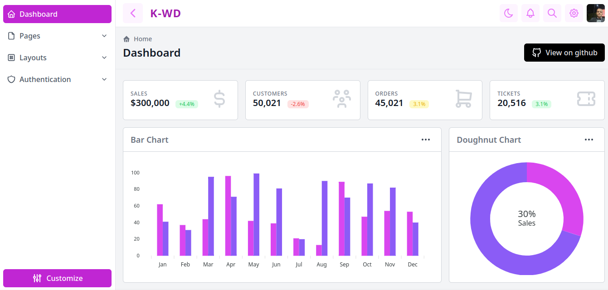
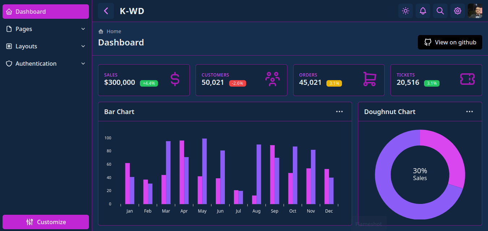

# K-WD Dashboard

Fully responsive dashboard template built with tailwindcss & alpinejs

[](https://github.com/Kamona-WD/starter-dashboard-layout/blob/main/License.md)
[](https://github.com/Kamona-WD/kwd-dashboard/stargazers)

|     |     |
| --- | --- |
|  |  |

## [See live](https://kamona-wd.github.io/kwd-dashboard/)

To get started:

1. Clone the repository:

```bash
git clone https://github.com/Kamona-WD/kwd-dashboard.git

cd kwd-dashboard
```

2. Install the dependencies:

```bash
yarn install

# Using npm
npm install
```

3. Start the development server:

```bash
yarn dev

# Using npm
npm run dev
```

## Building

```bash
yarn build

# Using npm
npm run build
```

## Preview

```bash
# Using npm
npm run preview

# Using Yarn
yarn preview
```

---

## Support

[](https://www.paypal.me/Akamel721/)
